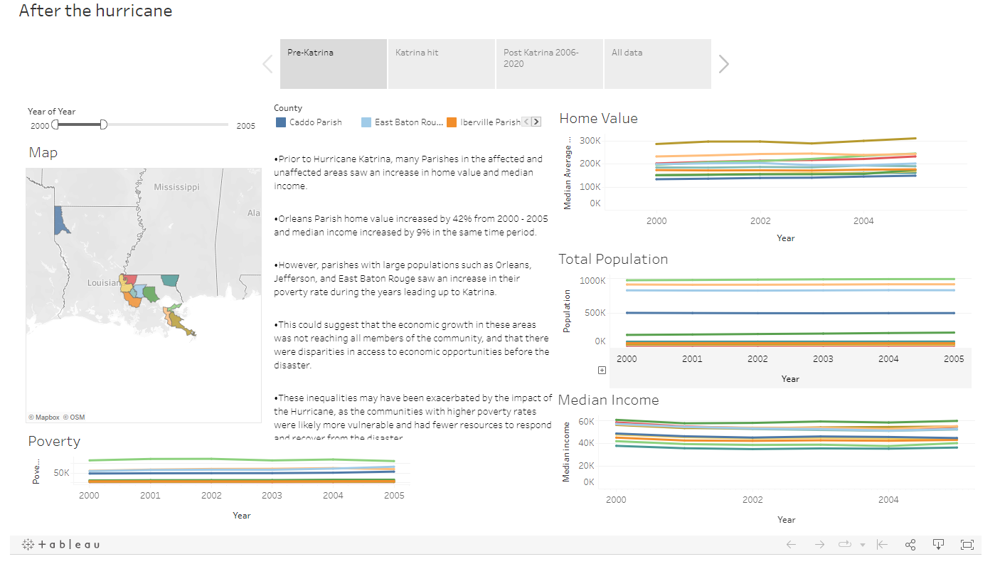

# Overview

The inspiration behind this project was to gain a deeper understanding of Hurricane Katrina and its impact on Louisiana. The team aimed to explore the role of FEMA in helping communities recover and rebuild in the aftermath of the disaster. During our research and analysis, we discovered that there were other forms of relief aid, such as the Road Home program, which provided assistance for rebuilding. Unfortunately, this data was not publicly available and we were unable to obtain it despite our requests. To gauge the condition of the various parishes, we looked at changes in income, home value, poverty, and demographics. We sourced the datasets for our analysis from FEMA, U.S. Census, Zillow, and the St. Louis Fed.

# Impact 

The current US disaster aid model assumes insurance companies should cover repair costs for homeowners and businesses, while FEMA provides aid in the form of grants for temporary housing and serious disaster-related expenses. Our analysis aims to examine the correlation between FEMA aid and community recovery and make recommendations to improve the current aid model if needed for more equitable distribution of aid.

## My contributions

*   <ins>Data sourcing</ins>: created a simple web scraper for downloading various csv files from sources such as zillow.com and census.gov
*   <ins>Data cleaning</ins>: used pandas to combine multiple csv files into one, filtering for data related to Louisiana, and pivoting or melting data into a cohesive data frame for our analysis.
*   <ins>Visualizations</ins>: used Matplotlib, Seaborn, and pandas to create line charts, stacked bar charts, box plots, and pie charts during our exploratory data analysis stage.
*   <ins>Tableau dashboard</ins>: assisted in designing the layout and built an action that allows the user to click on the map of Louisiana and get specific information about a parish.
*   <ins>Meetings</ins>: We held weekly meetings to discuss recent findings and updates on our share of the project. I had the opportunity to facilitate several meetings and create agendas to guide the discussions towards areas that I thought needed more attention. 

## Project Presentation

<video width="640" height="480" controls>
  <source src="video/pres.mp4" type="video/mp4">
  Your browser does not support the video tag.
</video>

## Dashboard

> Click on the dashboard to try it out

## Code

[Click me if you are curious about the code](https://github.com/5014NG3/ds4a_project_code)

## Data Sources

*   [St. Louis Fed](https://fred.stlouisfed.org/categories/28461)
*   [FEMA](https://www.fema.gov/openfema-data-page/individuals-and-households-program-valid-registrations-v1)
*   [Zillow](https://www.zillow.com/research/data/)
*   [Census Population](https://www2.census.gov/programs-surveys/popest/datasets/)
*   [Census Demographics 2000-2010](https://www2.census.gov/programs-surveys/popest/datasets/2000-2010/intercensal/county/)
*   [Census Demographics 2010-2020](https://www2.census.gov/programs-surveys/popest/datasets/2010-2020/counties/totals/)

